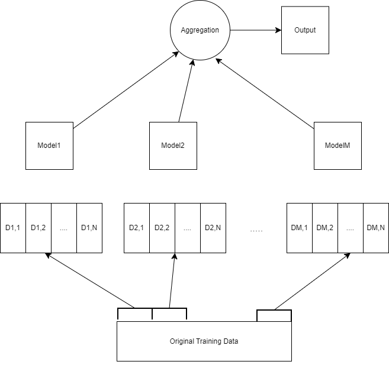

# Machine Unlearning for Facial Recognition Systems

Facial recognition systems are widely used in a variety of applications, including security and surveillance, identity verification, and personalization. However, worries about privacy, prejudice, and the possibility of misuse have highlighted the need for procedures to reduce the impact of incorrect or redundant data on these systems. In this context, machine unlearning has emerged as a viable solution to overcoming the difficulties associated with maintaining the accuracy, fairness, and dependability of facial recognition models over time. This study investigates the use of two common machine unlearning methods, task-agnostic machine unlearning, and SISA training, in the context of facial recognition systems. This work presents an overview of these algorithms and their use in facial recognition pipelines, focusing on their effectiveness in reducing the impact of redundant or sensitive data while maintaining model performance and integrity. Through empirical evaluations and case studies, we demonstrate the practical implications and potential benefits of incorporating machine unlearning techniques into facial recognition systems, emphasizing their role in improving privacy protection, reducing bias, and promoting responsible facial recognition technology adoption. Furthermore, we explore future research and development opportunities to improve the capabilities and scalability of machine unlearning approaches in the context of facial recognition systems.

Link to the dataset is available [here](https://postechackr-my.sharepoint.com/:u:/g/personal/dongbinna_postech_ac_kr/EbMhBPnmIb5MutZvGicPKggBWKm5hLs0iwKfGW7_TwQIKg?download=1 -O custom_korean_family_dataset_resolution_128.zip)

## Task-Agnostic Machine Unlearning Model Pipeline

## SISA (Shard, Incremental, Slice, Aggregation) Training Model Pipeline

